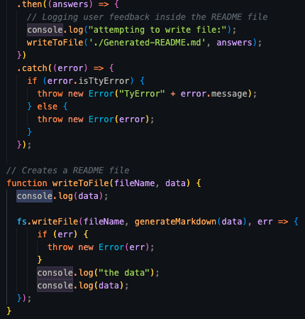

# README-Generator

## Description

Just having learned Node.js and how interesting I find how it works, I was very excited to start this challenge. I built this project to demonstrate how to create a README app using Node.js in the terminal. In creating this app, I learned how to create html and css in the terminal, how to structure and generate a README file.

Link to Walkthrough Demo Video: https://drive.google.com/file/d/1XbuR7N0fjCJIFjvVqPfut6mXkbJ5ospf/view

## Installation

To install, clone my repository README-Generator, locally to your computer.

## Usage

Provide instructions and examples for use. Include screenshots as needed.

To use this app, add console logs to the .then(), writeToFile(), and writeFile() functions. Then type "node.js index.js" in the terminal to answer prompts. Once finished a readme file "Generated-Readme" will appear in the Explorer panel where you will see the completed read me file. To preview, simply right click the tab of "Generated-Readme" and select "Open Preview".

   

## MIT License

Copyright (c) [2022] [Bethany Duchene-Jennings]

Permission is hereby granted, free of charge, to any person obtaining a copy
of this software and associated documentation files (the "Software"), to deal
in the Software without restriction, including without limitation the rights
to use, copy, modify, merge, publish, distribute, sublicense, and/or sell
copies of the Software, and to permit persons to whom the Software is
furnished to do so, subject to the following conditions:

The above copyright notice and this permission notice shall be included in all
copies or substantial portions of the Software.

THE SOFTWARE IS PROVIDED "AS IS", WITHOUT WARRANTY OF ANY KIND, EXPRESS OR
IMPLIED, INCLUDING BUT NOT LIMITED TO THE WARRANTIES OF MERCHANTABILITY,
FITNESS FOR A PARTICULAR PURPOSE AND NONINFRINGEMENT. IN NO EVENT SHALL THE
AUTHORS OR COPYRIGHT HOLDERS BE LIABLE FOR ANY CLAIM, DAMAGES OR OTHER
LIABILITY, WHETHER IN AN ACTION OF CONTRACT, TORT OR OTHERWISE, ARISING FROM,
OUT OF OR IN CONNECTION WITH THE SOFTWARE OR THE USE OR OTHER DEALINGS IN THE
SOFTWARE.